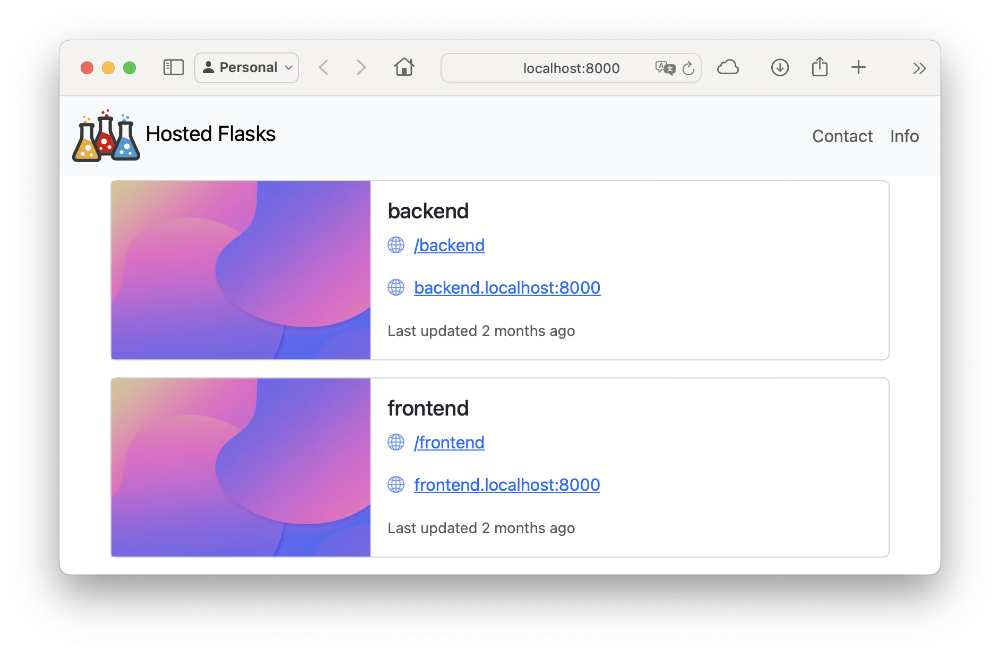

# Getting Started

Typical usage:

```console
% mkdir my_apps
% cd my_apps
```

Now create one or more flask apps, each in their own module/folder:

```console
% tree -a .
.
├── backend
│   ├── .env
│   └── __init__.py
└── frontend
    ├── .env
    └── __init__.py
```

For example containing the minimal Hello World Flask application:

```console
% cat backend/__init__.py 
from flask import Flask

app = Flask(__name__)

@app.route("/")
def hello_world():
  return "Hello My Backend"
```

For each application you want to serve as a Hosted Flask, add a `.env` file with some minimal configuration:

```console
% cat backend/.env 
HOSTED_FLASKS_PATH=/backend
HOSTED_FLASKS_HOSTNAME=backend.localhost
```

This configuration tells Hosted Flasks how this application should be served. In this case it is both served from a path on the default application (`/backend`), as well as on a custom hostname (`backend.localhost`).

Optionally, but highly recommended: set up a virtual environment.

```console
% pyenv virtualenv my_apps
% pyenv local my_apps
```

Install `hosted-flasks`, `gunicorn` and `eventlet` (or your other favorite WSGI server) and start the Hosted Flasks server app:

```console
% pip install hosted_flasks gunicorn eventlet

% gunicorn -k eventlet -w 1 hosted_flasks.server:app
[2024-04-27 11:27:25 +0200] [86515] [INFO] Starting gunicorn 22.0.0
[2024-04-27 11:27:25 +0200] [86515] [INFO] Listening at: http://127.0.0.1:8000 (86515)
[2024-04-27 11:27:25 +0200] [86515] [INFO] Using worker: sync
[2024-04-27 11:27:25 +0200] [86542] [INFO] Booting worker with pid: 86542
[hosted_flasks.scanner] [INFO] 👀 looking for apps in .
[hosted_flasks.scanner] [INFO] 🌎 imported frontend
[hosted_flasks.scanner] [INFO] 🌎 imported backend
[hosted_flasks.server] [INFO] ✅ 2 hosted flasks up & running...
```

You can now visit your backend Flask app from e.g.

* [http://localhost:8000/backend](http://localhost:8000/backend)
* [http://backend.localhost:8000](http://backend.localhost:8000)

And when visiting the root [http://localhost:8000](http://localhost:8000) you are presented with a frontpage listing the Hosted Flasks with links to their hosted locations:


